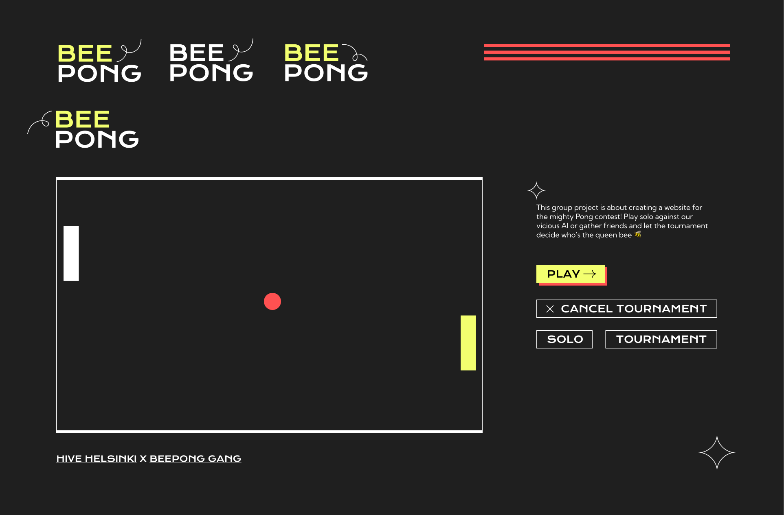

# 🐝 Bee pong!
This group project is about creating a website for the mighty Pong contest! 🏓

## Ways of working:
- Commit messages chould be in this format: `issue_number commit_message`, where commit_message follows [Conventional Commits standard](https://www.conventionalcommits.org/en/v1.0.0/)
- When creating a pull request, mention everyone and assign one person to review

## Architecture
### Game
- id
- player1
  - id
  - score
- player2
  - id
  - score
- state (PENDING, ONGOING, FINISHED)
- winner player
- timestamp(s)
#### Actions for Game:
- GET
- POST /games/ - Create game
    - Payload: {player1 id, player2 id}
- PUT /games/{gameId} - Update game
    - Payload: {player1 score, player2 score}
- PUT /games/{gameId} - Finish game

### Tournament
- id
- quarter1 (link to Game)
- quarter2
- quarter3
- quarter4
- semi1
- semi2
- final
- name
- description
- state (PENDING, ONGOING, FINISHED)
- num_players (2,4,8)
- players (links to players)
- winner player
- timestamp(s)
#### Actions for Tournament:
- GET
- POST /tournament - Create
- PUT /tournament/join Join
  - Payload: user id (or maybe none bc we have cookie?)
- PUT /tournament/leave Leave
  - Payload: user id
- Refresh tournament (when one of the games is finished, would probably be done from a websocket function but unsure)

### Player
- id
- username
- alias
- is_registered
- is_online ?
- ? auth info ?
- current tournament (link to Tournament)

## 6.6.2024 meeting
- games - simultaneous or consequtive?

## 8.6.2024 meeting
First priority:
- Create board (linh)
- Create docker setup
- Create prototype (lera)
- Create dummy project (database, devops, back, front)

## Features plan C:
- Web:
    - YES 1 Major module: Use a Framework as backend
    - MAYBE 0.5 Minor module: Use a front-end framework or toolkit
    - YES 0.5 Minor module: Use a database for the backend

- Gameplay and user experience:
    - MAYBE 1 Major module: Remote players
    - UNLIKELY 1 Major module: Multiplayers (2 vs. 2)

- User management
    - MAYBE 1 Auth
    - MAYBE 1 Remote auth
 
- AI algo
    - MAYBE 1 AI opponent

- Devops
    - PROBABLY 1 Major module: Infrastructure Setup for Log Management
    - MAYBE 0.5 Minor monitoring
    - PROBABLY 1 Major module: Designing the Backend as Microservices

- Accessibility
    - YES 0.5 Minor module: Expanding Browser Compatibility.
    - YES 0.5 Minor module: Multiple language supports.
    - YES 0.5 Accessibility

- Server-Side Pong
    - MAYBE 1 Major module: Replacing Basic Pong with Server-Side Pong and Implementing an API

YES: 3 backend, database, accessibility

PROBABLY: 1 devops: ELK

MAYBE:
- 4 Remote + multiplayer + server-side + microservices
- 2 AI opponent + more devops + bootstrap
- + 4 Remote auth + remote playing + server-side + 1 DevOps module else than microservices

June 8th plan:
Web
- Major module: Use a Framework as backend (1)
- Minor module: Use a database for the backend (0.5)
- 
User Management
Major module: Implementing a remote authentication (1)

Gameplay and user experience
- Major module: Remote players (1)
  
AI-Algo
- Major module: Introduce an AI Opponent (1)
  
Accessibility
- Minor module: Expanding Browser Compatibility (0.5)
- Minor module: Multiple language supports (0.5)
  
Server-Side Pong
- Major module: Replacing Basic Pong with Server-Side Pong and Implementing an API (1)
  
Dev-op: to be decided (1)

Sum: 7.5

## Resources
__Inspiration__
- [Agile and Documentation in ft_transcendence](https://medium.com/@glukas94/ft-transcendence-semana-1-3b641e683339)
- [ft_transcendence Project Architecture Overview](https://github.com/trancendering/ft_transcendence/blob/main/ARCHITECTURE.md)
- [How the Django-Docker-Frontend system can be connected](https://medium.com/@bekojix0660/42-ft-transcendence-0d952c94ea05)
- [Architecture & database diagram](https://github.com/zwzone/ft_transcendence)
- [42 API](https://api.intra.42.fr/apidoc) | Documentation to build an application with 42 API. | `Intra` |
